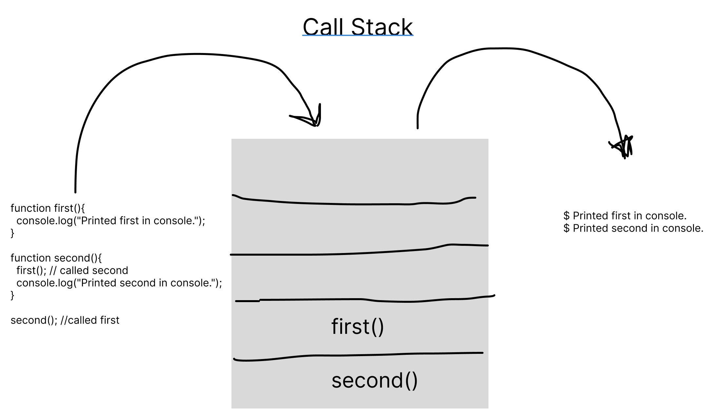

# **Class10 Reading Notes:**
---
---
---
## Why are these reading important?

```
By the end of this reading you will better understand how the Call Stack operates and how to work with the Error Messages provided when a bug arrises.
```

---

## [**Understanding the JavaScript Call Stack:**](https://www.freecodecamp.org/news/understanding-the-javascript-call-stack-861e41ae61d4)

* What is a 'call'?

  Function invocation.

* How many 'calls' can happen at once?

  One at a time.

* What does LIFO mean?
  
  It is an acronym standing for 'Last in First Out'. To make sense of the acronym think of a stack of dishes.

* Draw an example of a call stack and the functions that would need to be invoked to generate that call stack.

  

* What causes a Stack Overflow?

  When a function recursively calls itself without any means to terminate the loop.

---

## [**Javascript Error Messages:**](https://codeburst.io/javascript-error-messages-debugging-d23f84f0ae7c)

* What is a 'reference error'?

  When a function relies on a variable that wasn't defined before the function was declared.

* What is a 'syntax error'?

  This error is for problems relating to syntax/spelling/grammar.

* What is a 'range error'?

  Most often referencing outside of the range of a list/array.

* What is a 'type error'?

  Passing a variable/operand that doesn't fit the type expected for that function/operation.

* What is a breakpoint?

  It is a debugger statement places at a given line that will stop or pause the script when a condition is meet.

* What does the word 'debugger' do in your code?

  It is a keyword that stops the script at a give line.

---

## [**JavaScript errors reference on MDN:**](https://developer.mozilla.org/en-US/docs/Web/JavaScript/Reference/Errors)

---
---
---
## **Things I want to know more about:**

1. How to use the browser and the debugger keyword to troubleshoot a bug.

