# **Prework SQL Reading Notes:**
---
---
---
## Why are these reading important?

```
Structure Query Language databases are one of the most common types of databases used in the industry!
```

---

## **How too:**

* Prompt: Create new table and delete?

* Solution:

```python
#data_type: INTEGER, BOOLEAN, FLOAT, DOUBLE, REAL, TEXT,
#CHARACTER(num_chars), VARCHAR(num_chars),DATE, DATETIME, BLOB
#constraints: PRIMARY KEY, AUTOINCREMENT, UNIQUE, NOT NULL
#CHECK, FOREIGN KEY...
CREATE TABLE IF NOT EXISTS new_table (
    col_name1 data_type constraint DEFAULT def_value,
    col_name2 data_type constraint DEFAULT def_value,…);

#delete table
DROP TABLE IF EXISTS table_name;
```

* Prompt: Query table with either number or string values. How could you limit or sort the results?

* Solution:

```python
#SELECT * FROM table WHERE condition 
#operators: =, !=, <, <=, >, >=
SELECT * FROM table WHERE col_name != value; 
#number operators: AND, OR, NOT, IN, BETWEEN
...WHERE col_name BETWEEN 1 AND 100;
...WHERE col_name NOT IN (1,2,3);
#string operators: AND, OR, NOT, IN, LIKE, %, _
...WHERE col_name = 'abc';
...WHERE col_name NOT LIKE 'abcd';
...WHERE col_name LIKE '%at%';	#('bats','ATTIC')
...WHERE col_name LIKE 'an_';		#('and','AN')
#specify order
...ORDER BY column ASC/DESC
#limit rows
...LIMIT number OFFSET number
#test if null: IS NULL, IS NOT NULL
...WHERE IS NULL;
```

* Prompt: Perform a query between two tables.

* Solution:

```python
#INNER/LEFT/RIGHT/FULL JOIN table2 ON table1.id=table2.id
SELECT * 
FROM table1 
INNER JOIN table2 ON id=matching_id 
WHERE col1>col2 LIMIT 20;
```

* Prompt: Perform calculation during query.

* Solution: 

```Python
#perform new calculations and assign to new col4
SELECT col1, (col2+col3)/10 AS col4 
FROM table1 AS table3
LEFT JOIN table2 ON col5=col6;

#filter with calculations
SELECT * FROM table1 WHERE col1%2=0;

#agg_func: COUNT(),SUM(),AVG(),MIN(),MAX()
SELECT *, SUM(col1) AS col2 FROM table1 GROUP BY col3;

#subdivide group finer
SELECT COUNT(Role) AS Total 
FROM employees 
GROUP BY Role 
HAVING Role LIKE '%artist%';
```

* Prompt: Insert new row, delete row, or update certain columns.

* Solution: 

```Python
#with a complete row
INSERT INTO table1 VALUES (val1,val2,val3), (val1,val2,val3);
#with only some columns
INSERT INTO table1 (col1,col3) VALUES (val1,val3);

UPDATE table1 SET col1=val1, col2=val2 WHERE col3 LIKE "%query%"

DELETE FROM table1 WHERE col1=val1 AND col2=val2;
```

## Tutorial Screenshots:

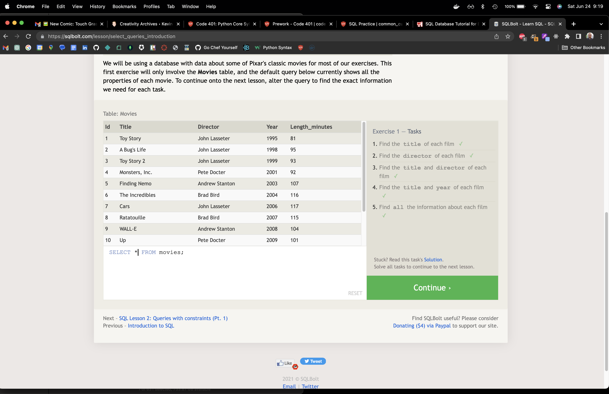
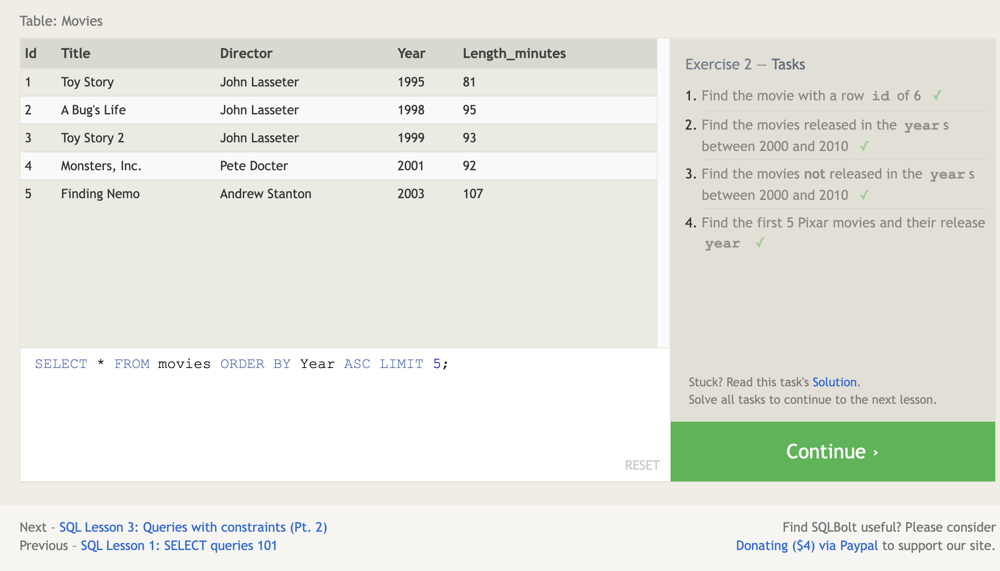
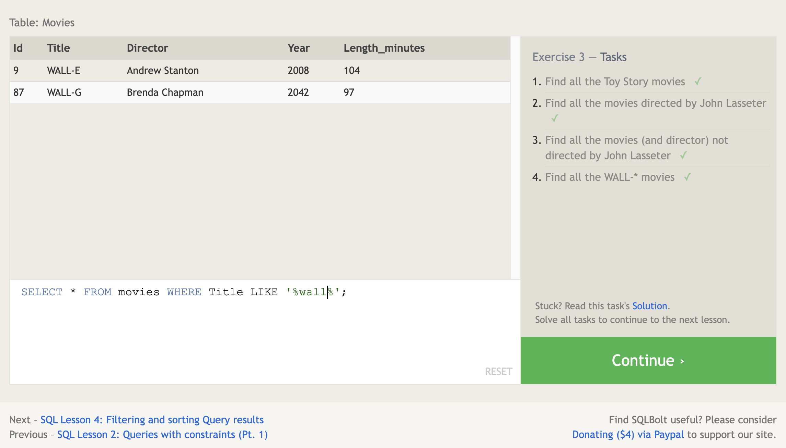
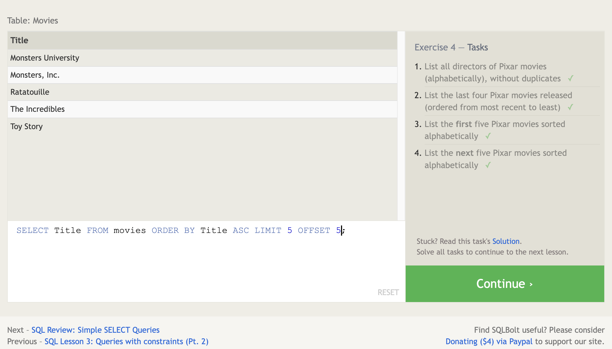
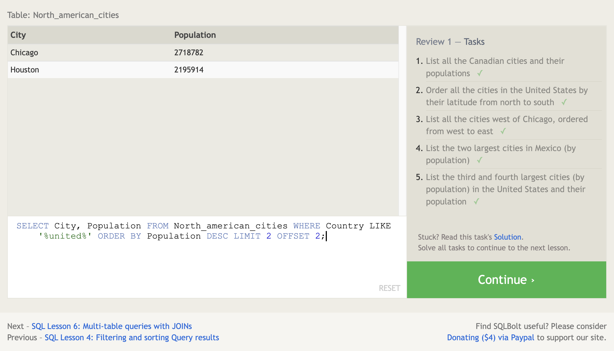
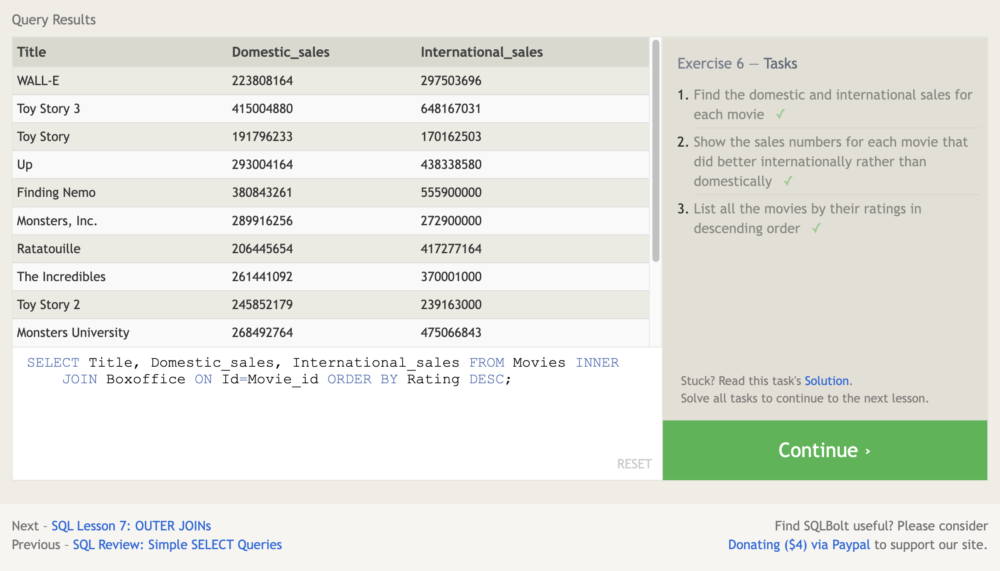
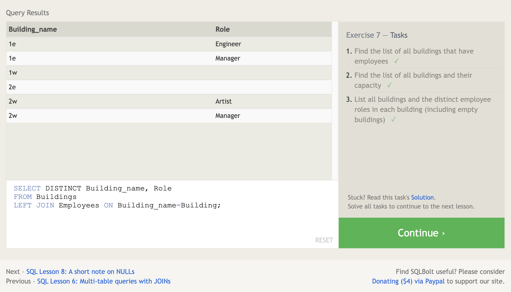
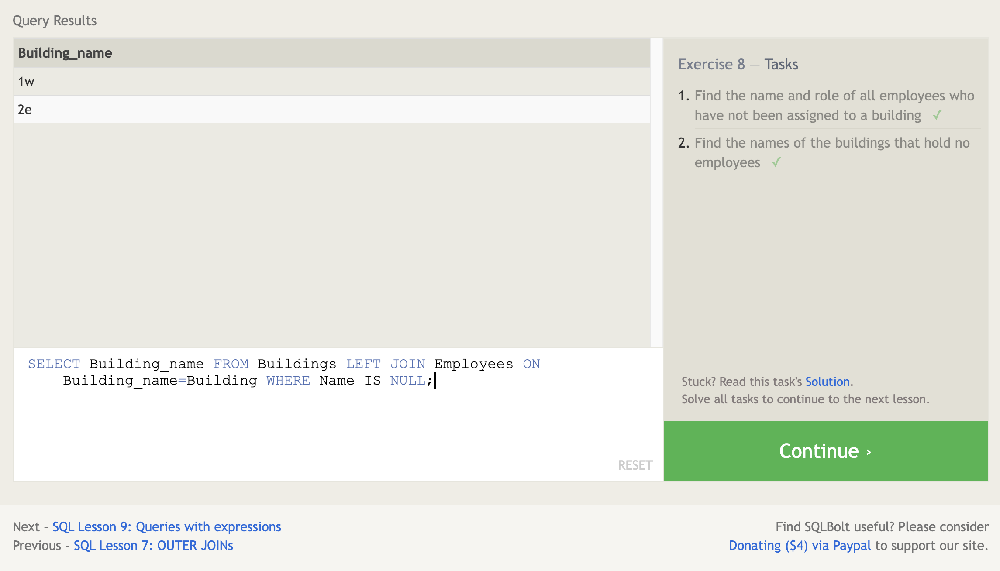
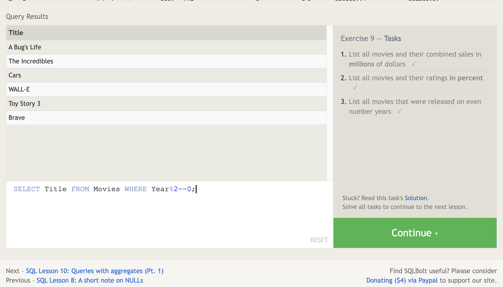
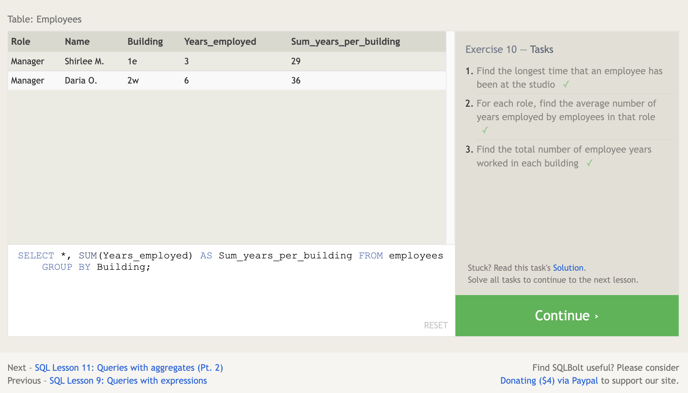
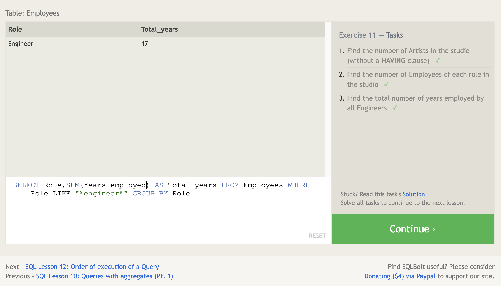
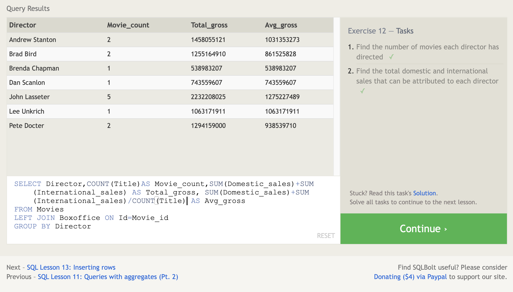
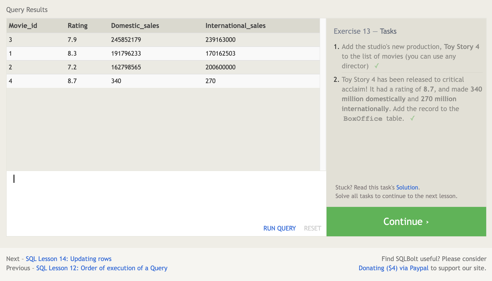
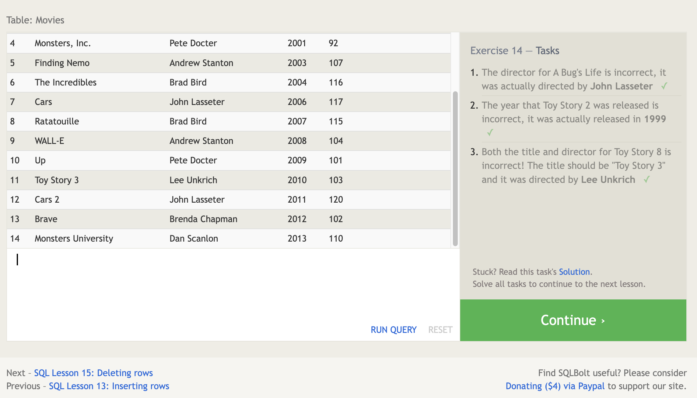
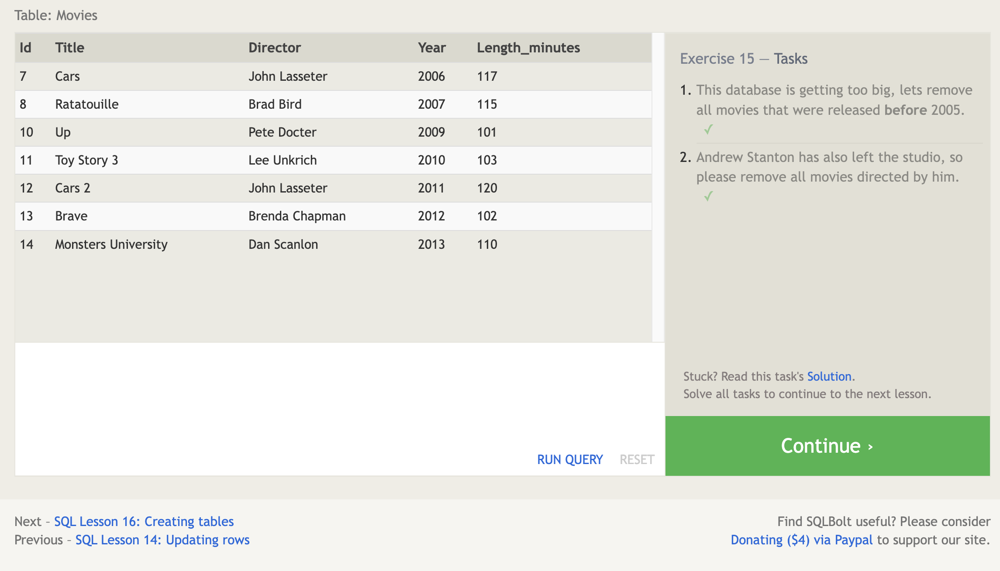
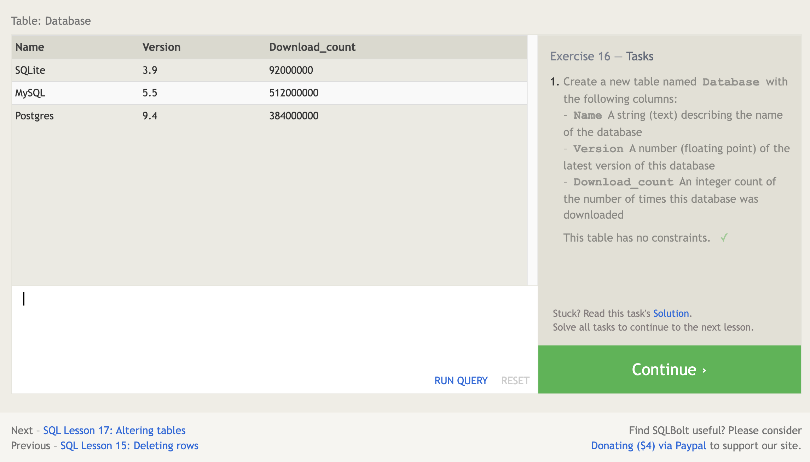
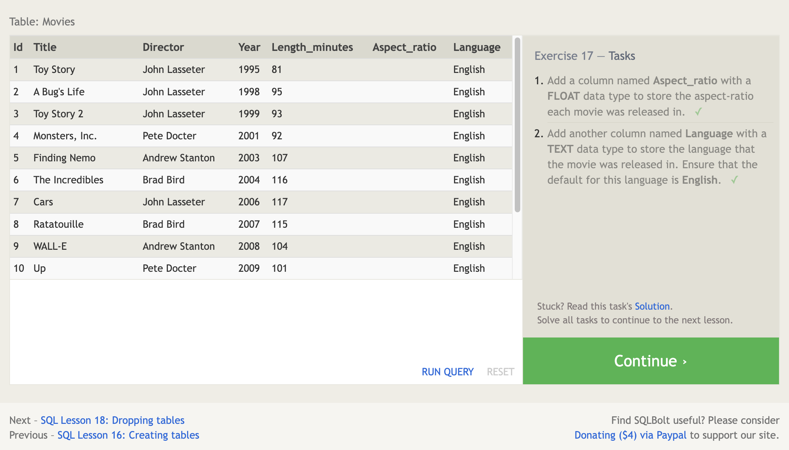
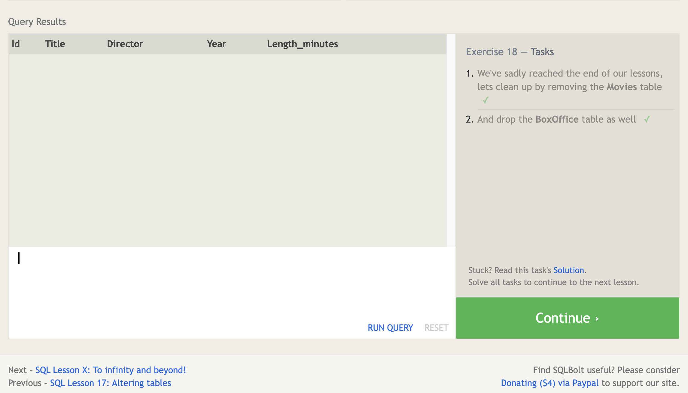

---
---
---


